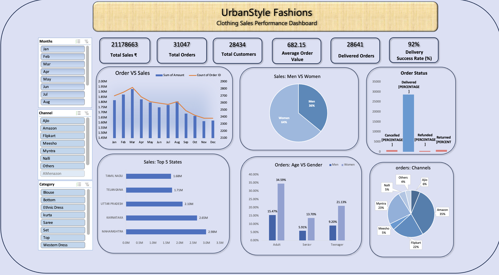

📁 3. Dashboard

## 📈 Dashboard Preview

File: UrbanStyle Analysis.xlsx
This is the final interactive dashboard built in Excel.

Dashboard Features:

KPI Cards (Total Sales, Orders, Customers, AOV, Delivery Rate)

Monthly Sales Trend

Gender Sales Distribution

Channel Order Share

Order Status Visualization

Top 5 States by Sales

Age Group vs Gender Analysis

Fully interactive slicers: Month, Category, Channel

The dashboard provides a complete visual overview of clothing sales performance.
